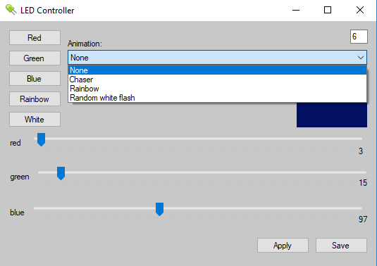

# pc-arduino-rgb-controller

RGB LED controller and smart notifications indicator for my gaming PC, arduino controller with a .NET application to control the LED via PC. This is a personal project I made for myself, so use it at your own risk.

## The Desktop Application

You can set custom colors using RGB sliders, minimize the application to tray.

## Smart Notification
Configure Automate or Tasker app on android to send a UDP packet to the PC with content "LEDX10:R,G,B,254", to trigger a notification animation. For example, for whatsapp notification I have set it to send "LEDX10:0,255,0,254" on receiving a WhatsApp notification.
